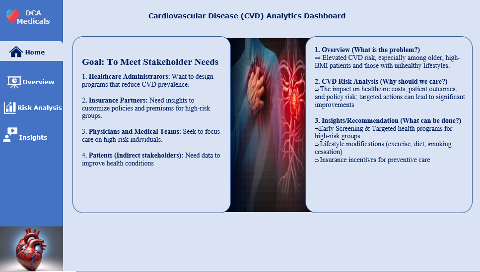
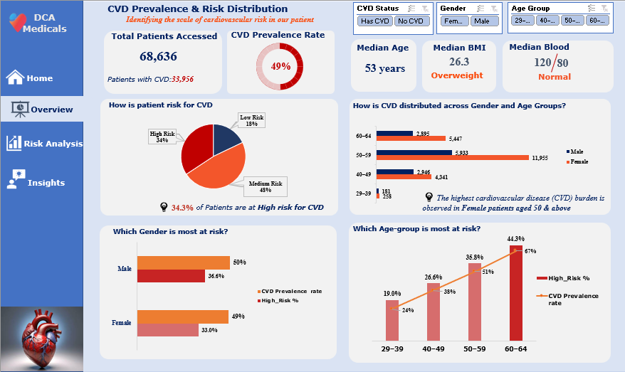
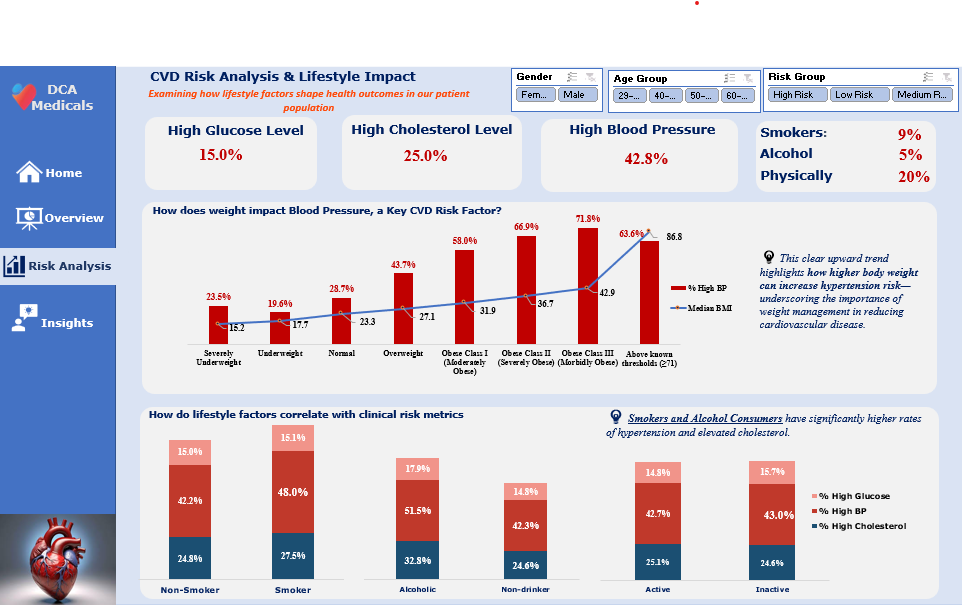
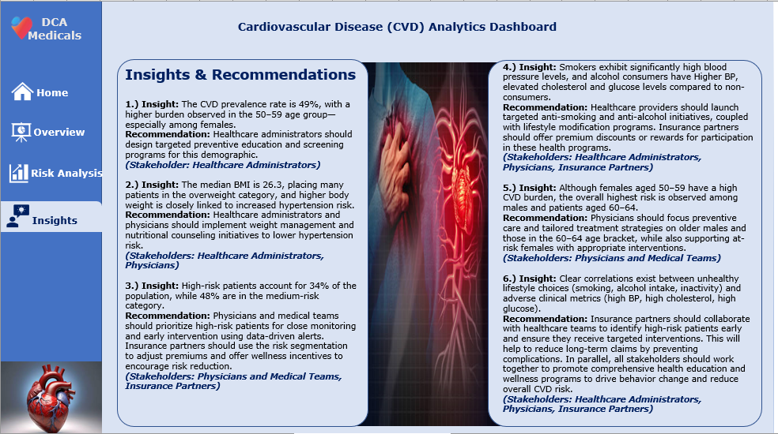

# CVD Risk Dashboard Analysis

An Excel-based cardiovascular disease risk analysis project that uses Power Query, Power Pivot, KPI measures, and interactive dashboard visuals to identify high-risk patient groups and support healthcare decision-making.

**Interactive Dashboard:** [Download Excel workbook](https://docs.google.com/spreadsheets/d/1Dxzx4OTfCwiJKJeecTbdBX2X5QMeb5p-MUhdOZaQJB4/export?format=xlsx)

## Business Problem

Cardiovascular disease (CVD) is a leading public health concern, yet many healthcare stakeholders lack clear insights to **identify high-risk patients early** and implement targeted prevention strategies.
This limits proactive care, efficient resource allocation, and data-driven insurance policy design.

## Target Audience

- Technical and non-technical healthcare stakeholders

## Objective

- Identify high-risk CVD patient groups using demographic and clinical data
- Analyze the impact of lifestyle factors on cardiovascular risk
- Deliver actionable insights for healthcare and insurance stakeholders

## Key KPIs

- CVD prevalence rate
- Risk distribution by age and gender
- BMI and hypertension relationship
- Blood pressure, cholesterol, and glucose trends

## Dataset

- **Source:** [Kaggle Cardiovascular Disease Dataset](https://www.kaggle.com/datasets/sulianova/cardiovascular-disease-dataset)
- **Key fields:** Age, gender, BMI, blood pressure, cholesterol, glucose, lifestyle factors, and CVD diagnosis indicators

## Tools Used

- Microsoft Excel
- Power Query
- Pivot Tables
- Power Pivot for data modeling and KPI measures

## Analysis Approach

- Cleaned and transformed patient-level data using Power Query
- Built relationships and KPI measures with Power Pivot
- Analyzed demographic, lifestyle, and clinical risk patterns
- Designed an interactive Excel dashboard with slicers and pivot charts

## Key Insights

- **49% of assessed patients had CVD**, with the highest burden among **women aged 50-59**
- **Males and individuals aged 60-64** showed the highest overall CVD risk
- **Overweight patients** exhibited a strong link to hypertension
- **Smokers and alcohol consumers** recorded elevated blood pressure, cholesterol, and glucose

## Recommendations

- **Healthcare administrators:** Implement targeted prevention programs for high-risk demographics
- **Physicians and medical teams:** Prioritize proactive screening and early intervention for patients aged **50+**
- **Insurance partners:** Apply risk-based segmentation to adjust premiums and introduce wellness incentives

## Skills Demonstrated

- Health data analysis
- Risk segmentation
- KPI design using Power Pivot
- Data modeling in Excel
- Stakeholder-focused storytelling
